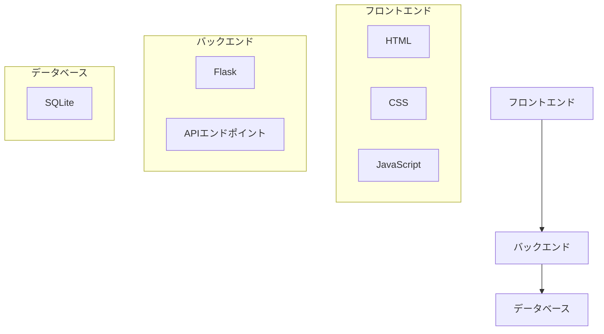
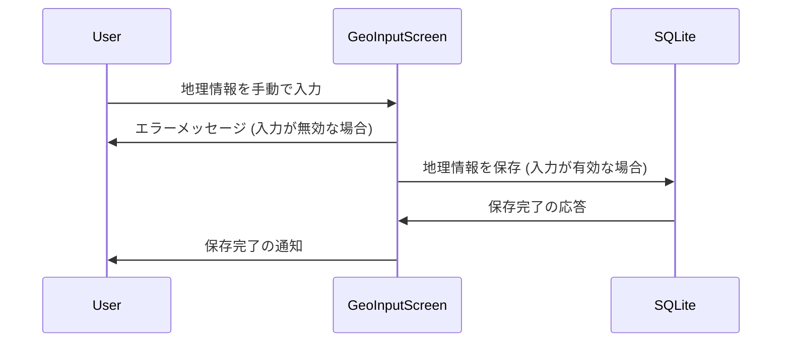
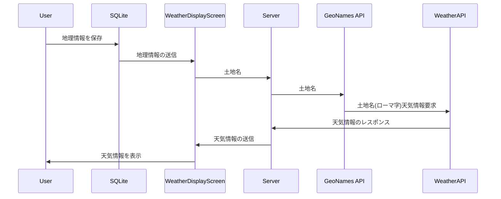
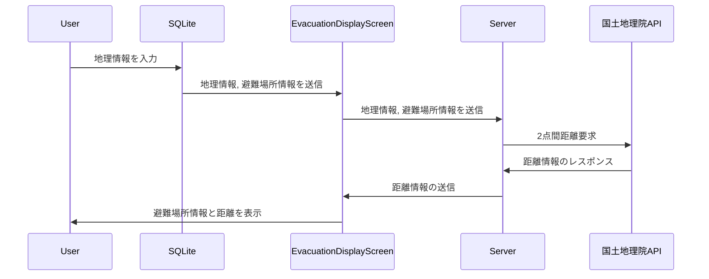
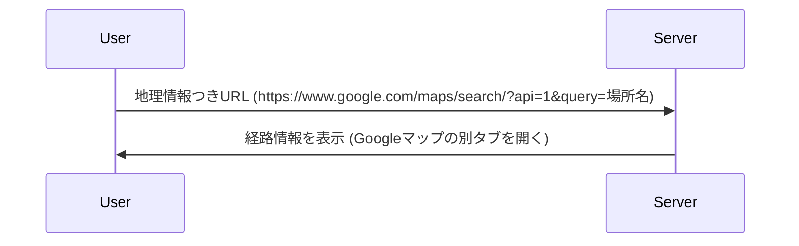

## README

---

# 防災アプリケーション

## 使用技術一覧

<!-- シールド一覧 -->
<p style="display: inline">
  
  
  
  
  
  
</p>

## 目次

- [防災アプリケーション](#防災アプリケーション)
  - [使用技術一覧](#使用技術一覧)
  - [目次](#目次)
  - [プロジェクトについて](#プロジェクトについて)
  - [環境](#環境)
  - [ディレクトリ構成](#ディレクトリ構成)
  - [開発環境構築](#開発環境構築)
  - [詳細設計](#詳細設計)
    - [システム構成図](#システム構成図)
    - [ソフトウェア構成図](#ソフトウェア構成図)
    - [機能設計](#機能設計)
    - [画面設計](#画面設計)
    - [データベース設計](#データベース設計)
    - [処理フロー](#処理フロー)
  - [トラブルシューティング](#トラブルシューティング)

<p align="right">(<a href="#top">トップへ</a>)</p>

## プロジェクトについて

このプロジェクトは、防災アプリケーションを開発するためのテンプレートです。ユーザーは地理情報を入力し、天気情報を取得して表示し、最寄りの避難場所とその経路を確認することができます。


<p align="right">(<a href="#top">トップへ</a>)</p>

## 環境

| 技術                   | バージョン |
| ---------------------- | ---------- |
| Python                 | 3.10.0     |
| Flask                  | 2.3.2      |
| Flask-SQLAlchemy       | 2.5.0      |
| Requests               | 2.25.0     |
| BeautifulSoup4         | 4.9.0      |
| Unidecode              | 1.1.1      |
| Pandas                 | 1.1.0      |
| SQLite                 | 3.39.3     |
| HTML/CSS/JavaScript    | 最新版     |

---

<p align="right">(<a href="#top">トップへ</a>)</p>

## ディレクトリ構成

```plaintext
.
├── README.md
├── __pycache__
│   └── config.cpython-38.pyc
├── app
│   ├── __init__.py
│   ├── __pycache__
│   │   ├── __init__.cpython-38.pyc
│   │   ├── models.cpython-38.pyc
│   │   └── routes.cpython-38.pyc
│   ├── models.py
│   ├── routes.py
│   ├── static
│   │   ├── css
│   │   │   ├── disaster_prevention_links.css
│   │   │   ├── geo_info.css
│   │   │   ├── route_info.css
│   │   │   ├── styles.css
│   │   │   └── weather_info.css
│   │   └── js
│   │       ├── city.js
│   │       ├── dbviewer.js
│   │       ├── index.js
│   │       └── weather_info_scripts.js
│   └── templates
│       ├── base.html
│       ├── disaster_prevention_links.html
│       ├── geo_info.html
│       ├── index.html
│       ├── route_info.html
│       └── weather_info.html
├── config.py
├── database.db
├── evacuation_site.json
├── instance
│   └── app.db
├── json_to_sqlite.py
├── requirements.txt
├── run.py
└── shelters.db
```

<p align="right">(<a href="#top">トップへ</a>)</p>

## 開発環境構築

1. **Python 環境のセットアップ**

   必要なパッケージをインストールします。

   ```bash
   pip install -r requirements.txt
   ```


2. **アプリケーションの起動**

   アプリケーションを起動します。

   ```bash
   python run.py
   ```

3. **アクセス**

   ブラウザで以下のURLにアクセスします。

   ```
   http://127.0.0.1:5000
   ```

<p align="right">(<a href="#top">トップへ</a>)</p>

## 詳細設計

### システム構成図


### ソフトウェア構成図



### 機能設計

1. **地理情報入力**: ユーザーが現在地または指定した場所の情報を入力します。
2. **天気情報表示**: 入力された地理情報に基づき、最新の天気情報を表示します。
3. **避難場所情報表示**: 入力された地理情報に基づき、最寄りの避難場所を表示します。
4. **避難経路表示**: 外部アプリに情報を渡して、避難場所までの最適な経路を表示します。

### 画面設計

1. **地理情報入力画面**
   - 地理情報の入力フィールド
   - 現在地取得ボタン

2. **天気情報表示画面**
   - 現在の天気情報
   - 予報情報

3. **避難場所表示画面**
   - 最寄りの避難場所リスト

4. **避難経路表示画面**
   - 現在地から避難場所までの経路地図

### データベース設計

**地理情報テーブル (geo_info)**

| カラム名       | データ型     | 説明             |
| -------------- | ------------ | ---------------- |
| id             | INTEGER      | プライマリキー   |
| latitude       | FLOAT        | 緯度             |
| longitude      | FLOAT        | 経度             |
| timestamp      | DATETIME     | 記録日時         |
| city_name      | VARCHAR(255) | 都市名           |

**天気情報テーブル (weather_info)**

| カラム名          | データ型     | 説明             |
| ----------------- | ------------ | ---------------- |
| id                | INTEGER      | プライマリキー   |
| geo_info_id       | INTEGER      | 外部キー         |
| temperature       | FLOAT        | 気温             |
| humidity          | FLOAT        | 湿度             |
| weather_condition | VARCHAR(255) | 天気の状態       |
| timestamp         | DATETIME     | 記録日時         |

**避難場所テーブル (evacuation_sites)**

| カラム名           | データ型     | 説明             |
| ------------------ | ------------ | ---------------- |
| id                 | INTEGER      | プライマリキー   |
| name               | VARCHAR(255) | 名称             |
| latitude           | FLOAT        | 緯度             |
| longitude          | FLOAT        | 経度             |
| address            | VARCHAR(255) | 住所             |
| disaster_response  | VARCHAR(255) | 災害対応情報     |

### 処理フロー

**地理情報入力の処理フロー**



**天気情報表示の処理フロー**



**避難場所情報表示の処理フロー**



**避難経路表示の処理フロー**



<p align="right">(<a href="#top">トップへ</a>)</p>

## トラブルシューティング


<p align="right">(<a href="#top">トップへ</a>)</p>